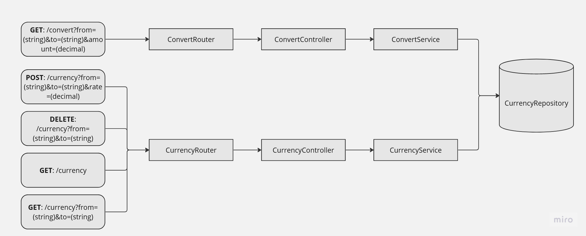
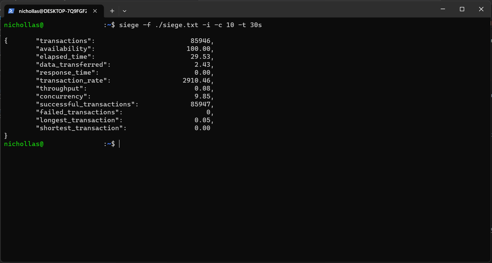

#  Bravo Challenge

[[English](README.md) | [Portuguese](README.pt.md)]

## Code Architecture

    

### Features

- Convert an amount from one currency to another
- Add a currency convert rate
- Delete a currency convert rate
- Get all the available convert rates
- Get a specific convert rate

## Endpoints

Convert an amount from one currency to another:
<pre><code>curl -X 'GET' \
    'http://localhost:3000/convert?from=USD&to=BRL&amount=1000'
</code></pre>

Add a currency convert rate:
<pre><code>curl -X 'POST' \
    'http://localhost:3000/currency?from=HURB&to=BRL&rate=5'
</code></pre>

Delete a currency convert rate:
<pre><code>curl -X 'DELETE' \
    'http://localhost:3000/currency?from=HURB&to=BRL'
</code></pre>

Get all the available convert rates:
<pre><code>curl -X 'GET' \
    'http://localhost:3000/currency'
</code></pre>

Get a specific convert rate:
<pre><code>curl -X 'GET' \
    'http://localhost:3000/currency?from=HURB&to=BRL'
</code></pre>

## Libraries and Tools

- [Node.js](https://nodejs.org/en/)
- [Redis](https://redis.io/)
- [Docker](https://www.docker.com/)
- [Express](https://expressjs.com/)
- [axios](https://www.npmjs.com/package/axios)
- [Jest](https://jestjs.io/)
- [SuperTest](https://www.npmjs.com/package/supertest)

### Motivation for the choices

The combination Node.js + Express was chosen for this project because, as the Express framework's own documentation states, it is a fast, unopinionated and minimalistic framework. As such, it allows for more freedom in configuration and customization and allows coding skills to really shine on the project.

The Redis database was chosen because of its great performance for tasks involving information caching. As one of the requirements of the challenge is precisely performance in high stress situations, the choice of this database was the most suitable. Moreover, this proved to be an excellent opportunity to deepen the knowledge of this technology.

The Docker container manager was chosen due to the recommendation of the challenge itself and also because it is a widely used technology in the market. Also, similar to Redis, this was an excellent opportunity to deepen the knowledge of this technology.

The other libraries (axios, Jest, SuperTest) were chosen because they are some of the most relevant in their respective fields in the JavaScript community.

## Tests

[Docker](https://www.docker.com/) is a prerequisite to run this project. Once its installed on the machine follow the steps below:

- Clone the repository to your machine
- Open a terminal in the containing folder of the project
- Run the command `sudo docker compose up` to build the docker image of the app and to run the containers with the application

After this the API should be running on the address `http://localhost:3000`. To test it, you can use your preferred tool for making HTTP requests ([curl](https://curl.se/), [Postman](https://www.postman.com/), etc).

### Unit Tests

To run the test suite, follow the steps below after the cloning of the repository and the execution of the application's containers:

- Open a terminal in the containing folder of the project
- Run the command `npm test`

Below it's a screenshot showing the unit tests coverage:

    

### Stress Tests

The stress test shown in the screenshot below was performed using the tool [Siege](https://www.joedog.org/siege-home/). The file with the URLs utilized in the test can be found <a href="README_assets/siege.txt">here</a>.

    

## Limitations and Possible Improvements

- Authentication and Authorization: These features were not considered, since its a simple implementation. Future versions could expand the functionalities of the API by adding Authentication and Authorization to it.
- Security: Apply OWASP recommendations for API security and other best practices.
- Synchronization of custom values: Synchronize the rates entered by the user with the rates from the external API (if the rate is available there).