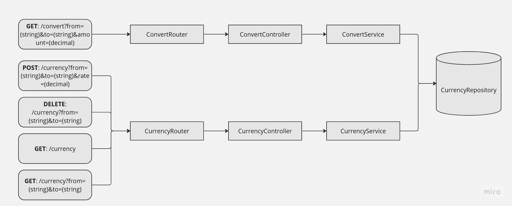

#  Bravo Challenge

[[English](README.md) | [Portuguese](README.pt.md)]

## Arquitetura do Código

    

### Features

- Converter um valor de uma moeda para outra
- Adicionar uma cotação de conversão de moedas
- Deletar uma cotação de conversão de moedas

## Endpoints

Converter um valor de uma moeda para outra:
<pre><code>curl -X 'GET' \
    'http://localhost:3000/convert?from=USD&to=BRL&amount=1000'
</code></pre>

Adicionar uma cotação de conversão de moedas:
<pre><code>curl -X 'POST' \
    'http://localhost:3000/currency?from=HURB&to=BRL&rate=5'
</code></pre>

Deletar uma cotação de conversão de moedas:
<pre><code>curl -X 'DELETE' \
    'http://localhost:3000/currency?from=HURB&to=BRL'
</code></pre>

## Bibliotecas e Ferramentas

- [Node.js](https://nodejs.org/en/)
- [Redis](https://redis.io/)
- [Docker](https://www.docker.com/)
- [Express](https://expressjs.com/)
- [axios](https://www.npmjs.com/package/axios)
- [Jest](https://jestjs.io/)
- [SuperTest](https://www.npmjs.com/package/supertest)

## Testes

[Docker](https://www.docker.com/) é um pré-requisito para rodar este projeto. Assim que estiver instalado na máquina, siga os passos abaixo:

- Clone o repositório para sua máquina
- Abra um terminal na pasta que contêm o projeto
- Rode o comando `sudo docker compose up` para construir a imagem do app e para executar os contêineres com a aplicação

Depois disso, a API deverá estar disponível no endereço `http://localhost:3000`. Para testá-la, você pode usar sua ferramenta preferida para fazer requisições HTTP ([curl](https://curl.se/), [Postman](https://www.postman.com/), etc).

## Limitações e Possíveis Melhorias

- Autenticação e Autorização: Estas features não foram consideradas, visto que se trata de uma implementação simples. Versões futuras poderiam expandir as funcionalidades da API adicionando Autenticação e Autorização à ela.