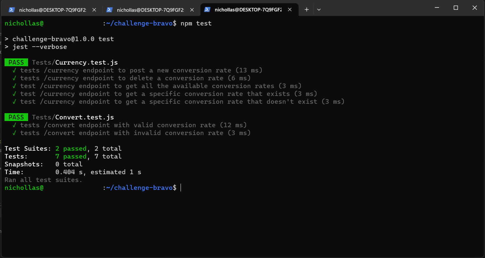
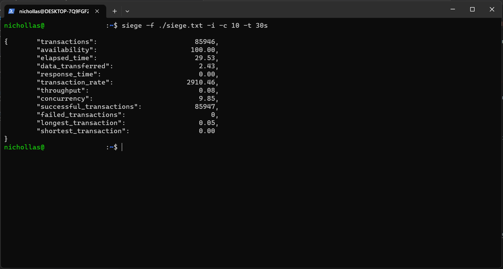

#  Bravo Challenge

[[English](README.md) | [Portuguese](README.pt.md)]

## Arquitetura do Código

    

### Features

- Converter um valor de uma moeda para outra
- Adicionar uma cotação de conversão de moedas
- Deletar uma cotação de conversão de moedas
- Obter todas as cotações de conversão de moedas disponíveis
- Obter uma cotação de conversão de moedas específica

## Endpoints

Converter um valor de uma moeda para outra:
<pre><code>curl -X 'GET' \
    'http://localhost:3000/convert?from=USD&to=BRL&amount=1000'
</code></pre>

Adicionar uma cotação de conversão de moedas:
<pre><code>curl -X 'POST' \
    'http://localhost:3000/currency?from=HURB&to=BRL&rate=5'
</code></pre>

Deletar uma cotação de conversão de moedas:
<pre><code>curl -X 'DELETE' \
    'http://localhost:3000/currency?from=HURB&to=BRL'
</code></pre>

Obter todas as cotações de conversão de moedas disponíveis:
<pre><code>curl -X 'GET' \
    'http://localhost:3000/currency'
</code></pre>

Obter uma cotação de conversão de moedas específica:
<pre><code>curl -X 'GET' \
    'http://localhost:3000/currency?from=HURB&to=BRL'
</code></pre>

## Bibliotecas e Ferramentas

- [Node.js](https://nodejs.org/en/)
- [Redis](https://redis.io/)
- [Docker](https://www.docker.com/)
- [Express](https://expressjs.com/)
- [axios](https://www.npmjs.com/package/axios)
- [Jest](https://jestjs.io/)
- [SuperTest](https://www.npmjs.com/package/supertest)

### Motivação das escolhas

A combinação Node.js + Express foi escolhida para esse projeto pois, conforme a própria documentação do framework Express diz, o mesmo se trata de um framework rápido, sem opinião e minimalista. Dessa forma, o mesmo permite maior liberdade de configuração e customização e permite que as habilidades de codificação realmente brilhem no projeto.

O banco de dados Redis foi escolhido devido a sua ótima performance para tarefas que envolvem cacheamento de informação. Como um dos requisitos do desafio é justamente a performance em situações de alto estresse, a escolha desse banco de dados foi a que mais se adequou. Além disso, esta se mostrou uma excelente oportunidade para aprofundamento do conhecimento desta tecnologia.

O gerenciador de contêineres Docker foi escolhido devido a recomendação do próprio desafio e também por ser uma tecnologia amplamente utilizada no mercado. Além disso, semelhante ao Redis, esta também se mostrou uma excelente oportunidade para aprofundamento do conhecimento desta tecnologia.

As demais bibliotecas (axios, Jest, SuperTest) foram escolhidas por serem algumas das mais relevantes no seu campo de atuação na comunidade JavaScript.

## Testes

[Docker](https://www.docker.com/) é um pré-requisito para rodar este projeto. Assim que estiver instalado na máquina, siga os passos abaixo:

- Clone o repositório para sua máquina
- Abra um terminal na pasta que contêm o projeto
- Rode o comando `sudo docker compose up` para construir a imagem do app e para executar os contêineres com a aplicação

Depois disso, a API deverá estar disponível no endereço `http://localhost:3000`. Para testá-la, você pode usar sua ferramenta preferida para fazer requisições HTTP ([curl](https://curl.se/), [Postman](https://www.postman.com/), etc).

### Testes Unitários

Para executar a suite de testes, após a clonagem do repositório e execução dos contêineres com a aplicação, siga os passos abaixo:

- Abra um terminal na pasta que contêm o projeto
- Rode o comando `npm test`

Abaixo um print com a cobertura dos testes unitários:

    

### Testes de Estresse

O teste de estresse demonstrado no print abaixo foi realizado utilizando a ferramenta [Siege](https://www.joedog.org/siege-home/). O arquivo com as URLs utilizadas no teste pode ser encontrado <a href="README_assets/siege.txt">aqui</a>.

    

## Limitações e Possíveis Melhorias

- Autenticação e Autorização: Estas features não foram consideradas, visto que se trata de uma implementação simples. Versões futuras poderiam expandir as funcionalidades da API adicionando Autenticação e Autorização à ela.
- Segurança: Aplicar as recomendações da OWASP para segurança de APIs e outras boas práticas.
- Sincronização dos valores customizados: Sincronizar as cotações informadas pelo usuário com as cotações da API externa (se a cotação estiver disponível na mesma).